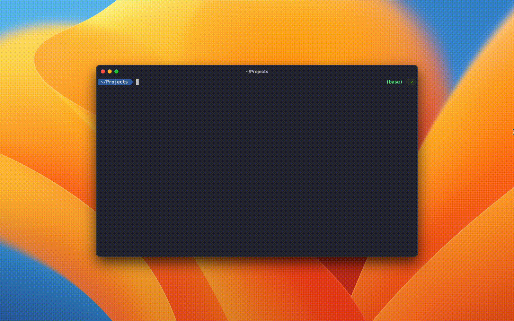

# `create-swift-package`



A command-line utility to create Swift packages with ✨ flair ✨

- 🔮 **Interactive:** Answer a set of questions interactively to configure your shiny new Swift package.
- ⚒️ **Feature-rich:** Built-in support for generating `library` and `executable` products, mixed-language targets and more.
- 👷 **Extensive support:** Allows you to generate packages targeting macOS, iOS, watchOS and tvOS from Swift 5.4+.
- 🚦 **Well-tested:** Supported by unit and integration tests over various Swift tools versions. 

## 🎁 Installation

`create-swift-package` is distributed via `npm`. You can run it with `npx`:

```bash
$ npx create-swift-package
```

or install with Yarn:

```bash
$ yarn global add create-swift-package
$ create-swift-package
```

## 🧑‍💻 Usage

Run `create-swift-package` without any arguments. It runs in interactive mode to prompt you to configure your product and targets. You can optionally provide a directory that you want your new package to be located in.

There are also a couple of command-line flags which are supported:
- `--no-prompt-xcode`: When the package has been successfully created, don't prompt you to open it in Xcode.
- `--no-swift-build`: By default `create-swift-package` runs `swift build` in your new package directory to validate that it has been set up correctly. Disable this check with this flag.
- `--dry-run`: Do everything apart from actually creating the package and files.

## 📦 Supported setups

### 🛠️ Swift tools

Support for Swift tools versions >= 5.4. Defaults to your currently installed Swift version. Versions greater than your currently installed Swift version are disabled.

### 📱 Platforms

Supports generating packages for iOS 8.0+, macOS 10.10+, watchOS 2.0+ and tvOS 9.0+

### 📦 Products

Supports generating both `library` and `executable` [products](https://docs.swift.org/package-manager/PackageDescription/PackageDescription.html#product).

### 🗣️ Language support

Swift targets can include **either** Swift or C-family (C/C++/Objective-C/Objective-C++) code but not both. `create-swift-package` allows you to create packages that support either Swift code, C-family code or a mix of both:
- Swift and C-family packages are created with a single target containing either Swift or C-family code. 
- Mixed packages are created with two targets: one which includes Swift code, and another (postfixed with `ObjCxx`) including C-family code. The swift target depends on the C-family target.

**C-style Headers**

- C-family targets require a public headers directory; this defaults to `include` but can be configured.
- `create-swift-package` creates a single [umbrella header](https://github.com/apple/swift-package-manager/blob/893ccb491ed54573b9b07abf8c22ff135ead1f28/Documentation/Usage.md#creating-c-language-targets) in your public headers directory with the same name as your C-family target

### 🏎️ Tests

Test targets can be created for library or executable products, for both Swift and Objective-C targets.

## 🙋‍♂️ FAQ

### Why isn't this written in Swift?

Swift is great for lots of things, but this is a good case of using the right tool for the job. `create-swift-package` is built using some great `npm` packages including [prompts](https://github.com/terkelg/prompts) and [ora](https://github.com/sindresorhus/ora) for its interactivity, which would have been much harder to do in Swift.
